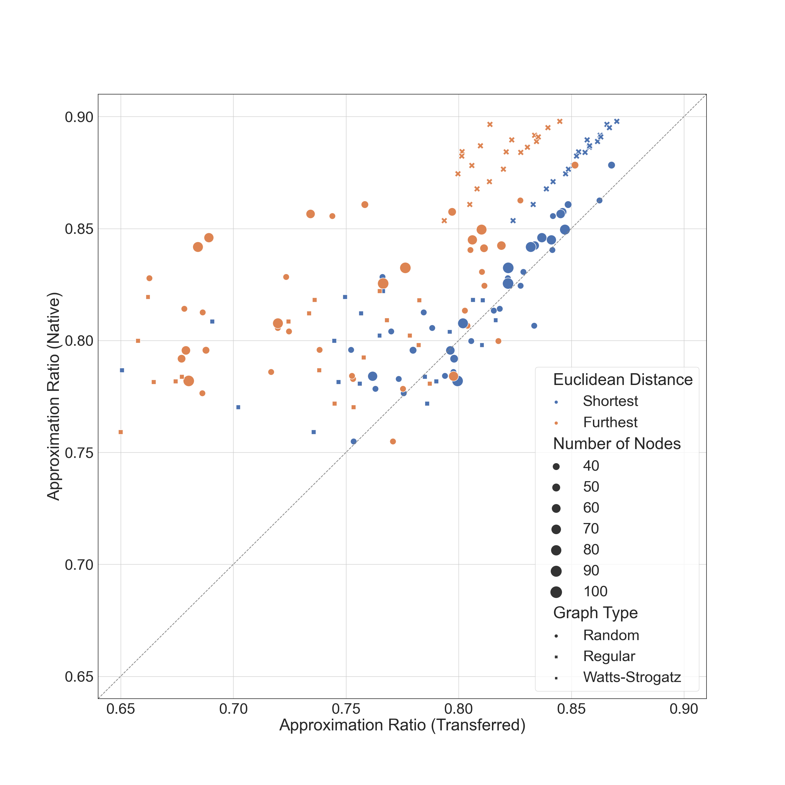
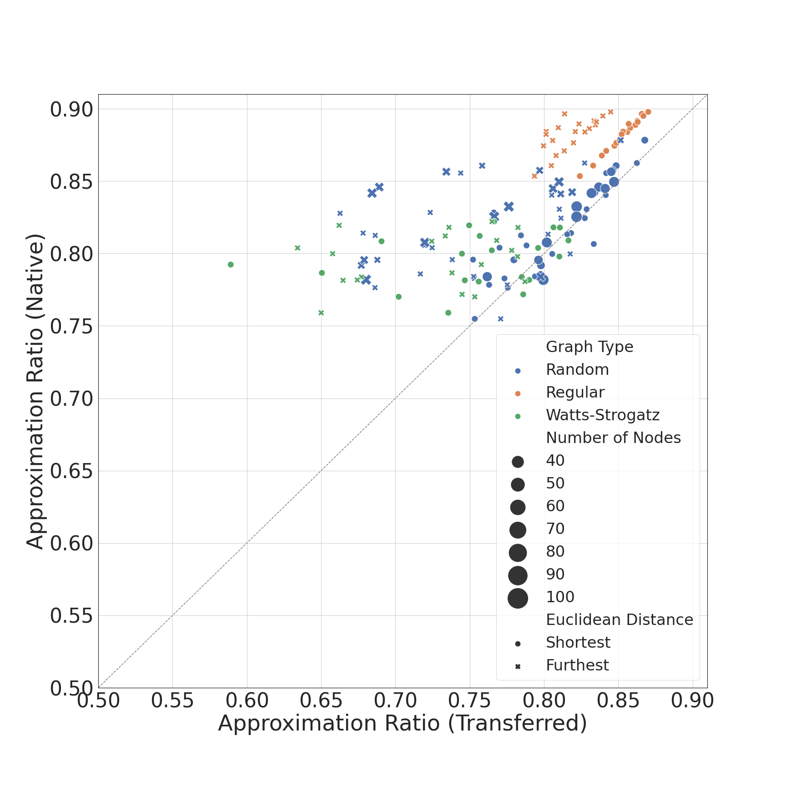

# Quantum Approximate Optimization Algorithm
These next two figures are part of my research on a variational quantum algorithm, the quantum approximate optimization algorithm (QAOA), used to find approximate solutions to combinatorial optimization problems. Specifically, in this work, I use graph embedding techniques (machine learning, woo!) to determine whether the variational parameters associated to an optimal solution on one instance can be successfully transferred to another instance.

## Before Figure

<figcaption>Figure 1. Performance of GL2Vec graph embedding at predicting good donor candidates for different types of graphs. The different marker symbols represent different graphs (random, regular, and Watts-Strogatz), while the different colors represent the "best" and "worst" predictions based on the distance of embedded vectors measured by their Euclidean distance.</figcaption>

## After Figure

<figcaption>Transferability of optimal QAOA parameters with donor graphs chosen via GL2Vec embedding. Data in circles and crosses show shortest and furthest Euclidean distance in the embedded space, respectively. Different types of graphs are differentiated by color.</figcaption>

## Changes
Even though the changes I made to the original (before) figure are small, I do think they improved the figure significantly (and the before figure was actually in the manuscript). The change was with the labels: while graph types were labeled by marker shape and Euclidean distance by color in the first figure, in the second figure graph types are labeled by color and Euclidean distance by marker shape. The thing I appreciated the most was that in the second figure, the shortest Euclidean distance between embedded vectors (ie. good candidates) are shown in circles, while furthest Euclidean distances are shown in crosses, and that adds intuition, since we generally associated crosses with "bad".
