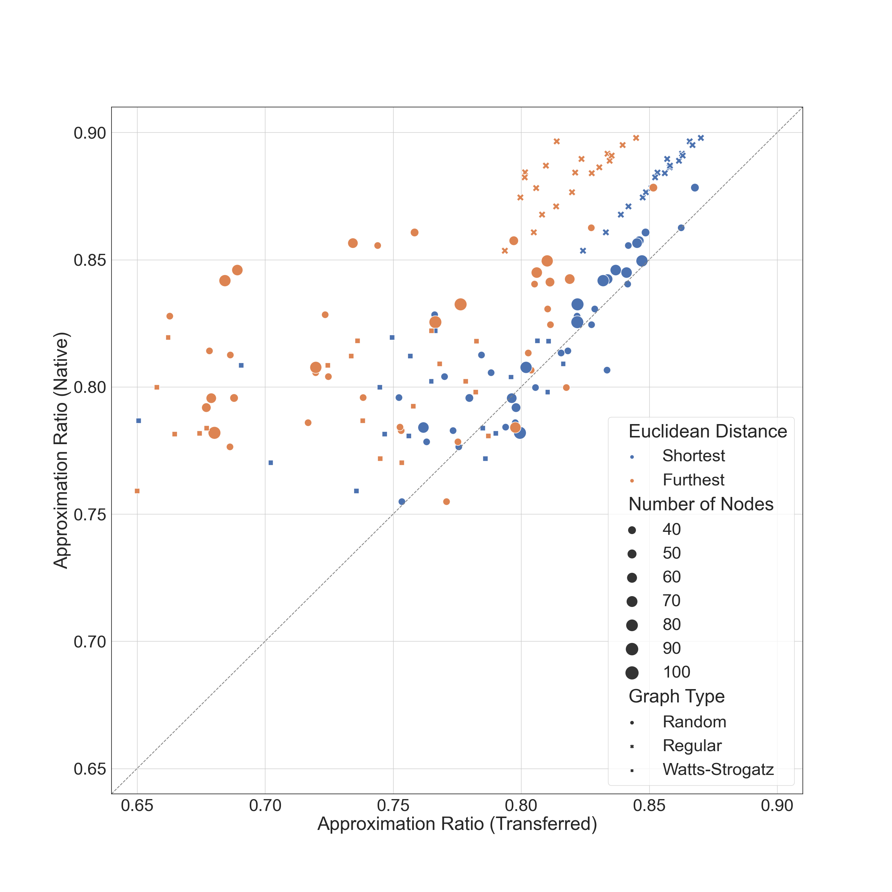

# Quantum Approximate Optimization Algorithm
These next two figures are part of my research on a variational quantum algorithm, the quantum approximate optimization algorithm (QAOA), used to find approximate solutions to combinatorial optimization problems. Specifically, in this work, I use graph embedding techniques (machine learning, woo!) to determine whether the variational parameters associated to an optimal solution on one instance can be successfully transferred to another instance.

## Before Figure

